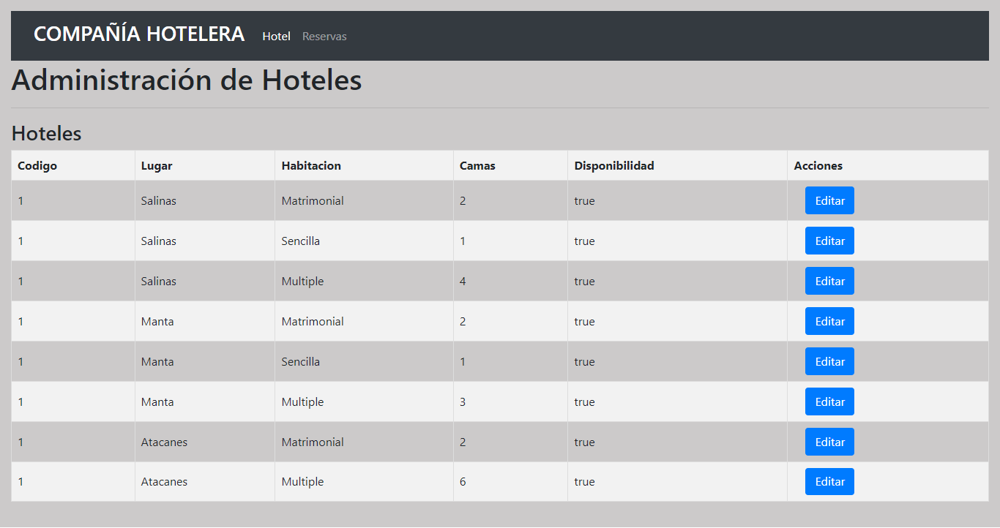
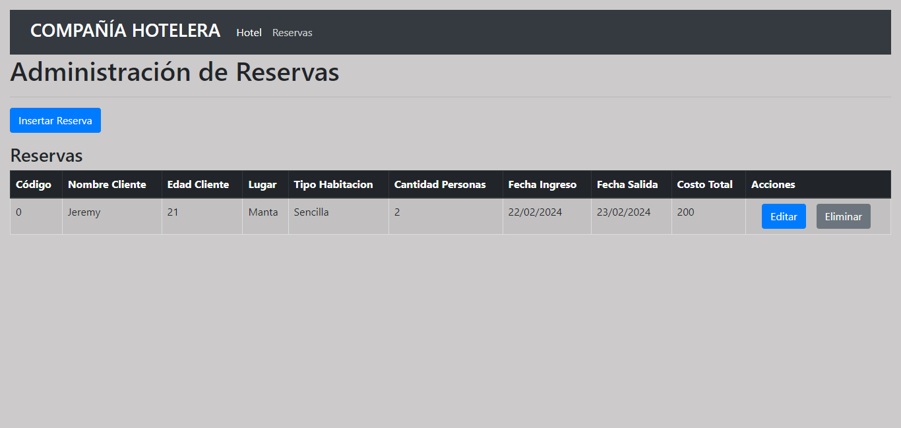
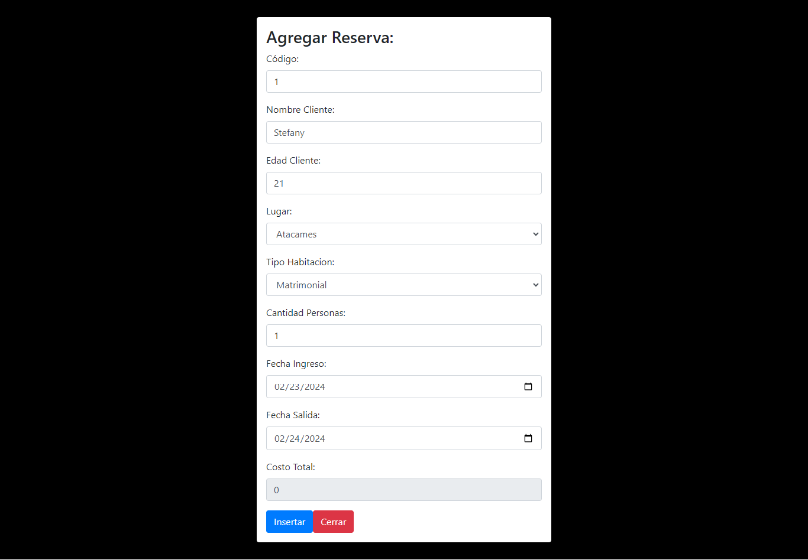
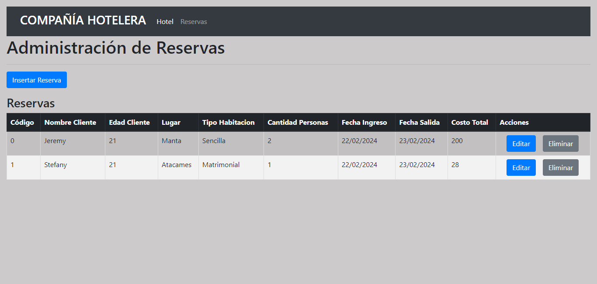

**PRUEBA DE PROGRAMACION MOVIL**

Una empresa hotelera registró los costos de hospedaje. La empresa cuenta tres hoteles en diferente ciudad: 

<table><tr><th valign="bottom">Lugar</th><th valign="bottom">Habitación</th><th valign="bottom"># Camas</th><th valign="bottom">Costo</th></tr>
<tr><td rowspan="3">Salinas</td><td valign="bottom">Matrimonial</td><td>2</td><td valign="bottom">50 x persona</td></tr>
<tr><td valign="bottom">Sencilla</td><td>1</td><td valign="bottom">70 x persona</td></tr>
<tr><td valign="bottom">Múltiple</td><td>4</td><td valign="bottom">30 x persona</td></tr>
<tr><td rowspan="3">Manta</td><td valign="bottom">Matrimonial</td><td valign="bottom">2</td><td valign="bottom">60 x persona</td></tr>
<tr><td valign="bottom">Sencilla</td><td valign="bottom">1</td><td valign="bottom">100 x persona</td></tr>
<tr><td valign="bottom">Múltiple</td><td valign="bottom">3</td><td valign="bottom">80 x persona</td></tr>
<tr><td rowspan="2">Atacames</td><td valign="bottom">Matrimonial</td><td valign="bottom">2</td><td valign="bottom">40 x persona</td></tr>
<tr><td valign="bottom">Múltiple</td><td valign="bottom">6</td><td valign="bottom">20 x persona</td></tr>
</table>

Para realizar la reserva de una habitación se considera:

- Nombre del cliente
- Lugar de alquiler
- Tipo de habitación
- Cantidad de personas a hospedarse
- Fecha de ingreso
- Fecha de salida

Hacer un programa que permita calcular el total a pagar por el hospedaje considerando lo siguiente: 

- El costo se calcula por el número de días por el costo de hospedaje.
- En un mismo alquiler puede tener a personas normales, tercera edad y niños ejemplo 4 personas (2 personas adultas, 1 personas tercera edad y 1 niño). 
- Si la persona es mayor de edad tiene un descuento de boletos del 30 %. Si la persona es menor de 5 años tiene el 20 % de descuento.
- Se podrá alquilar la habitación si el número de camas coincide con la cantidad de personas, caso contrario emitir un mensaje de sugerencia el lugar y la habitación donde puedan hospedarse con esa cantidad de personas.  
- No se podrá alquilar una habitación si ya fue alquilada, debe estar liberada la habitación.

Crear las listas de objetos que permita administrar (listar, insertar, modificar y eliminar), del problema planteado.           

Results:
- Take in consideration that are more components created into the folder Components('Bus-Componente, Chofer-Componente, tool-bar, Hotel-componente, Habitación-comopnente') we don't use to this case, were there due to we made the exam in a existing project.

- Made by Jeremy Prieto

